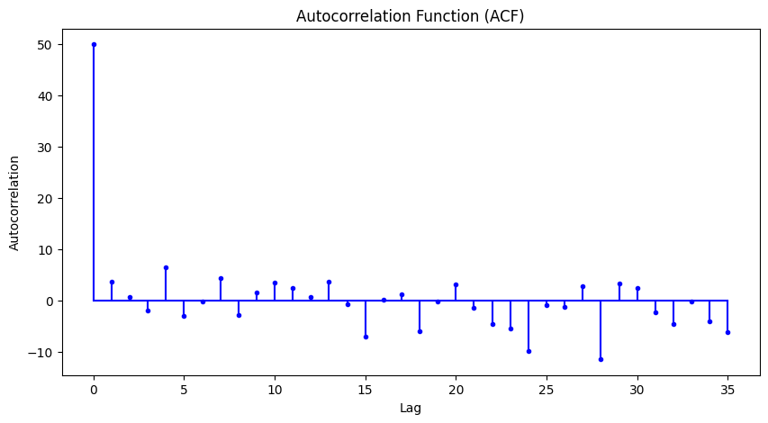

# Ex.No: 03   COMPUTE THE AUTO FUNCTION(ACF)
Date: 

### AIM:
To Compute the AutoCorrelation Function (ACF) of the data for the first 35 lags to determine the model
type to fit the data.
### ALGORITHM:
1. Import the necessary packages
2. Find the mean, variance and then implement normalization for the data.
3. Implement the correlation using necessary logic and obtain the results
4. Store the results in an array
5. Represent the result in graphical representation as given below.
### PROGRAM:
NAME : Kavinraja D

REG NO : 212222240047
```PY
import numpy as np
import pandas as pd
import statsmodels.api as sm
import matplotlib.pyplot as plt

data = [3, 16, 156, 47, 246, 176, 233, 140, 130, 101, 166, 201, 200, 116, 118, 247, 209, 52, 153, 232, 128, 27, 192, 168, 208, 187, 228, 86, 30, 151, 18, 254, 76, 112, 67, 244, 179, 150, 89, 49, 83, 147, 90, 33, 6, 158, 80, 35, 186, 127]

# Mean
data_mean = np.mean(data)

# Variance
data_var = np.var(data)

# Normalized data
normalized_data = (data - data_mean) / np.sqrt(data_var)

# Compute the autocorrelation function (ACF)
acf_result = np.correlate(normalized_data, normalized_data, mode='full')

# Take only the positive lags
acf_result = acf_result[len(acf_result)//2:]

# Plot the ACF
plt.figure(figsize=(10, 5))
plt.stem(acf_result[:36], use_line_collection=True)
plt.xlabel('Lag')
plt.ylabel('Autocorrelation')
plt.title('Autocorrelation Function (ACF)')
plt.show()
```

### OUTPUT:


### RESULT:
Thus we have successfully implemented the auto correlation function in python.
